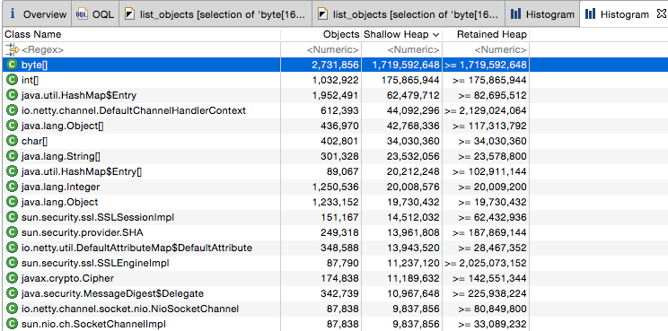
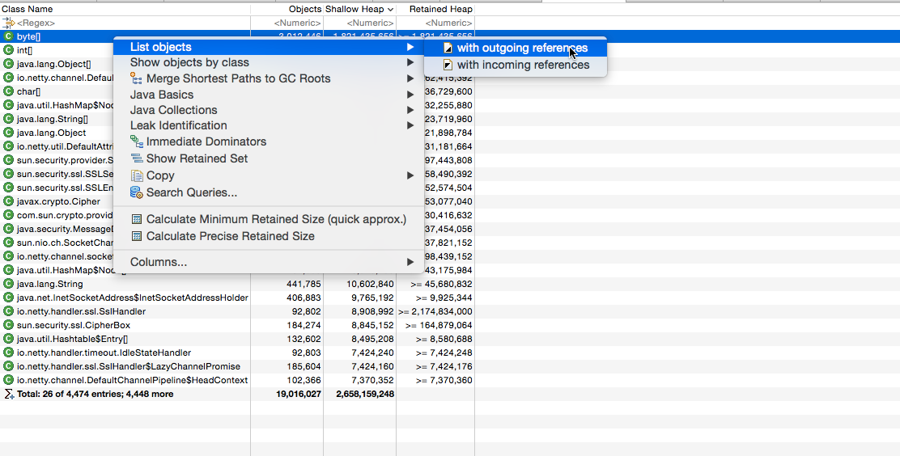
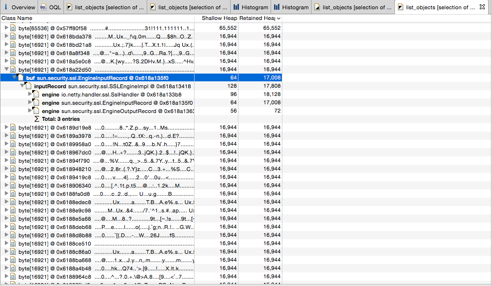

# Netty + TLS 内存优化实践

## 背景
公司要做手机端的推送，在对比各种中间件后选择了 Netty ,因为其性能高、使用广泛、并且文档齐全。

## 开发测试
开发时，定的具体的目标是要做到单台机器能够最少保持150万的链接，在开发的过程中参考了网上一个大牛的文章 [100万并发连接服务器笔记之准备篇](http://www.blogjava.net/yongboy/archive/2013/04/09/397559.html)，成功用 Netty 做到了 150万的链接（非TLS模式）。从测试结果上看，150万的链接，只使用了5.7G的内存，看起来单个机器做到300万是不成问题的。

开发完成后，由于公司的需要，通信的内容要必须加密，由于在 Netty 上面使用 TLS 十分方便，所以就简单的加了几行代码，完成后并没有在针对 TLS 的版本做过测试。

```java
SSLEngine engine = sslEngineFactory.getSSLEngine();
engine.setUseClientMode(false);
pipeline.addLast(new SslHandler(engine));
```

非 TLS 测试结果

```
www@dev:/tmp/push-server$ ss -s
Total: 1492929 (kernel 0)
TCP:   1496141 (estab 1492758, closed 3362, orphaned 0, synrecv 0, timewait 3360/0), ports 0

Transport Total     IP        IPv6
*     0         -         -
RAW   0         0         0
UDP   9         8         1
TCP   1492779   17        1492762
INET      1492788   25        1492763
FRAG      0         0         0


www@dev:/tmp/push-server$ top -p 19591
top - 14:49:04 up 42 days,  5:27,  3 users,  load average: 0.18, 0.25, 0.40
Tasks:   1 total,   0 running,   1 sleeping,   0 stopped,   0 zombie
Cpu(s):  0.1%us,  0.0%sy,  0.0%ni, 99.9%id,  0.0%wa,  0.0%hi,  0.0%si,  0.0%st
Mem:  32934964k total, 20784288k used, 12150676k free,   386576k buffers
Swap:  7812092k total,        0k used,  7812092k free,  2196720k cached

  PID USER      PR  NI  VIRT  RES  SHR S %CPU %MEM    TIME+  COMMAND
19591 www       20   0 14.1g 5.7g  12m S    1 18.1  21:19.33 java
```

## 上线后发现内存占用比想象的多
上线后运行倒是挺稳定的，但是发现比 DEV 测试的时候要消耗内存，不到10K的链接，Java FullGC 后 老生代 占用在2.2G，如果链接数量到达100万，那么内存使用最少需要22G，虽然现在 64G 内存的服务器很普遍，但是这么多的内存，会使得 FullGC 变得频繁，进而会影响系统的吞吐量。


## 寻找问题

先把 Java 的堆 dump 下来使用 mat 分析

```
$ jmap -dump:live,format=b,file=/data1/x.log pid
```

使用 mat 分析的时候由于堆比较大，所以需要先调整 mat 的 JVM 参数

```
在 MemoryAnalyzer.app/Contents/MacOS/MemoryAnalyzer.ini 添加2行

-Xms3096m
-Xmx3096m
```
通过分析发现，占用内存最多的是 byte[] ,大概有 1.7G



通过 outgoing references 可以分析具体有哪些数组，各自占用了多少



按照大小排序，发现有很多大小为 16944 的数组，被 inputRecord 引用，这种对象的数量刚好和打开的链接数量差不多，并且查看具体的数组内容发现很有规律的，这些数组基本上只使用前面300多位，后面都是浪费的，问题差不多定位出来了，就是因为 inputRecord 的这个对象大量的浪费了内存。


## 解决问题

inputRecord 对象定义在 SSLEngineImpl 类中

```java
inputRecord = new EngineInputRecord(this);
inputRecord.enableFormatChecks();
```

实例化 EngineInputRecord 对象的时候，直接实例化了一个 16921 大小的一个数组。

```java


   interface Record {
    /*
     * There are four SSL record types, which are part of the interface
     * to this level (along with the maximum record size)
     *
     * enum { change_cipher_spec(20), alert(21), handshake(22),
     *      application_data(23), (255) } ContentType;
     */
    static final byte   ct_change_cipher_spec = 20;
    static final byte   ct_alert = 21;
    static final byte   ct_handshake = 22;
    static final byte   ct_application_data = 23;

    static final int    headerSize = 5;         // SSLv3 record header
    static final int    maxExpansion = 1024;    // for bad compression
    static final int    trailerSize = 20;       // SHA1 hash size
    static final int    maxDataSize = 16384;    // 2^14 bytes of data
    static final int    maxPadding = 256;       // block cipher padding
    static final int    maxIVLength = 256;      // IV length

    /*
     * The size of the header plus the max IV length
     */
    static final int    headerPlusMaxIVSize =
                                      headerSize        // header
                                    + maxIVLength;      // iv

    /*
     * SSL has a maximum record size.  It's header, (compressed) data,
     * padding, and a trailer for the message authentication information (MAC
     * for block and stream ciphers, and message authentication tag for AEAD
     * ciphers).
     *
     * Some compression algorithms have rare cases where they expand the data.
     * As we don't support compression at this time, leave that out.
     */
    static final int    maxRecordSize =
                                      headerPlusMaxIVSize   // header + iv
                                    + maxDataSize           // data
                                    + maxPadding            // padding
                                    + trailerSize;          // MAC or AEAD tag    

                                    
                                    
	EngineInputRecord(SSLEngineImpl engine) {
        super();
        this.engine = engine;
    }


	InputRecord() {
        super(new byte[maxRecordSize]); //maxRecordSize=16921
        setHelloVersion(ProtocolVersion.DEFAULT_HELLO);
        pos = headerSize;
        count = headerSize;
        lastHashed = count;
        exlen = 0;
        v2Buf = null;
    }                                    
```

既然数组中只有300多个位在使用，那么定义成16921肯定是有些浪费的，那么现在有2个问题。

1. 既然是浪费的，那么我改成小的值会有问题吗？

2. 多少是合适的？   

第1个问题：经过测试发现，只要这个数组的大于 5 就不会有问题（5是 TLS 记录的头大小），如果放不下的话，会自动扩充。

```java
		/*
         * Grow "buf" if needed. Since buf is maxRecordSize by default,
         * this only occurs when we receive records which violate the
         * SSL specification. This is a workaround for a Microsoft SSL bug.
         */
        if (contentLen > buf.length - headerSize) {
            byte[] newbuf = new byte[contentLen + headerSize];
            System.arraycopy(buf, 0, newbuf, 0, headerSize);
            buf = newbuf;
        }
```

第2个问题：每次数组在扩充的时候，会申请一个新的数组，然后复制，性能肯定受影响。设置小了会复制多次，设置大了浪费内存，具体多少是合适的，还要看看这个 inputRecord 对象的具体作用是啥。
通过分析， inputRecord 这个对象存储的数据是 TLS 6次握手中 client 发送到服务器端的数据，和握手完成后客户端发送给服务器端的数据没有关系。最简单的就是抓个包分析下。从下面的结果可以看出, Client 端 TLS 握手阶段总共给 Server 端发送了4次数据 ，分别是 308 、 155 、 6 、 45，这四个数据就存放在 inputRecord 端,这4个数据都放到了 inputRecord 中，最大的一个包就是 308。结合之间使用 mat 分析的结果， 16944大小的数组中只有300多个数据，这下就对应上了。所以合理的值就是比308稍微大一点（不同的Client 可能发送的大小不同），我这里选用了 512，我这里使用了单向认证，如果是双向认证，客户端会发送自己的证书，这个值可能稍微大一点，单也不至于有16k的大小 。

```
//开始3次握手
19:03:34.174095 IP 127.0.0.1.63706 > 127.0.0.1.8443: Flags [S], seq 1520071310, win 65535, options [mss 16344,nop,wscale 5,nop,nop,TS val 295300502 ecr 0,sackOK,eol], length 0
19:03:34.174176 IP 127.0.0.1.8443 > 127.0.0.1.63706: Flags [S.], seq 130706225, ack 1520071311, win 65535, options [mss 16344,nop,wscale 5,nop,nop,TS val 295300502 ecr 295300502,sackOK,eol], length 0
19:03:34.174197 IP 127.0.0.1.63706 > 127.0.0.1.8443: Flags [.], ack 1, win 12759, options [nop,nop,TS val 295300502 ecr 295300502], length 0
//3次握手完成
//这里服务器端 ack 了一下最后一次握手信息
19:03:34.174211 IP 127.0.0.1.8443 > 127.0.0.1.63706: Flags [.], ack 1, win 12759, options [nop,nop,TS val 295300502 ecr 295300502], length 0

//client端 Client Hello
19:03:34.174476 IP 127.0.0.1.63706 > 127.0.0.1.8443: Flags [P.], seq 1:309, ack 1, win 12759, options [nop,nop,TS val 295300502 ecr 295300502], length 308
19:03:34.174508 IP 127.0.0.1.8443 > 127.0.0.1.63706: Flags [.], ack 309, win 12749, options [nop,nop,TS val 295300502 ecr 295300502], length 0

//server端 Server Hello
19:03:34.219704 IP 127.0.0.1.8443 > 127.0.0.1.63706: Flags [P.], seq 1:1012, ack 309, win 12749, options [nop,nop,TS val 295300547 ecr 295300502], length 1011
19:03:34.219766 IP 127.0.0.1.63706 > 127.0.0.1.8443: Flags [.], ack 1012, win 12727, options [nop,nop,TS val 295300547 ecr 295300547], length 0

//client端 Client Key Exchange
19:03:34.233921 IP 127.0.0.1.63706 > 127.0.0.1.8443: Flags [P.], seq 309:464, ack 1012, win 12727, options [nop,nop,TS val 295300561 ecr 295300547], length 155
19:03:34.233985 IP 127.0.0.1.8443 > 127.0.0.1.63706: Flags [.], ack 464, win 12744, options [nop,nop,TS val 295300561 ecr 295300561], length 0

//Client端 Change Cipher Spec
19:03:34.234125 IP 127.0.0.1.63706 > 127.0.0.1.8443: Flags [P.], seq 464:470, ack 1012, win 12727, options [nop,nop,TS val 295300561 ecr 295300561], length 6
19:03:34.234148 IP 127.0.0.1.8443 > 127.0.0.1.63706: Flags [.], ack 470, win 12744, options [nop,nop,TS val 295300561 ecr 295300561], length 0

//Client端 Finished
19:03:34.234250 IP 127.0.0.1.63706 > 127.0.0.1.8443: Flags [P.], seq 470:515, ack 1012, win 12727, options [nop,nop,TS val 295300561 ecr 295300561], length 45
19:03:34.234271 IP 127.0.0.1.8443 > 127.0.0.1.63706: Flags [.], ack 515, win 12743, options [nop,nop,TS val 295300561 ecr 295300561], length 0

//Server端  Change Cipher Spec && Finished
19:03:34.256397 IP 127.0.0.1.8443 > 127.0.0.1.63706: Flags [P.], seq 1012:1063, ack 515, win 12743, options [nop,nop,TS val 295300583 ecr 295300561], length 51
19:03:34.256428 IP 127.0.0.1.63706 > 127.0.0.1.8443: Flags [.], ack 1063, win 12726, options [nop,nop,TS val 295300583 ecr 295300583], length 0

```

inputRecord 的问题解决了，outputRecord 是不是也有相同的问题呢？outputRecord 还真没有问题，在单向 TLS 中 outputRecord 是几乎不占用大小的，不过却有一个类似的对象在握手期间占用大概16k的大小，并且在握手接受后释放掉了，所以使用 mat 分析的时候，基本上找不到这个对象的影子，这个对象就是 ServerHandshaker 的一个实例。从抓包的结果看，server 端向 client 端写了2次数据1011 、51 ，最大的数据是1011（这个大小取决于自己公钥的大小 & 签名公钥的大小，我这里是测试环境的自签名的公钥）。这个值多少是合理的，可以自己再根据不同的情况抓包分析下。


```java
final class ServerHandshaker extends Handshaker {
...

//end ServerHandshaker

abstract class Handshaker {
...
	HandshakeInStream input;
	HandshakeOutStream output;
...

//end Handshaker


public class HandshakeOutStream extends OutputStream {
...
	OutputRecord r;
	HandshakeOutStream(ProtocolVersion protocolVersion,
            ProtocolVersion helloVersion, HandshakeHash handshakeHash,
            SSLEngineImpl engine) {
        this.engine = engine;
        r = new EngineOutputRecord(Record.ct_handshake, engine);
        init(protocolVersion, helloVersion, handshakeHash);
    }
//end  HandshakeOutStream  
    
    
final class EngineOutputRecord extends OutputRecord {

    EngineOutputRecord(byte type, SSLEngineImpl engine) {
        super(type, recordSize(type));
        this.engine = engine;
        writer = engine.writer;
    }

    /**
     * Get the size of the buffer we need for records of the specified
     * type.
     * <P>
     * Application data buffers will provide their own byte buffers,
     * and will not use the internal byte caching.
     */
    private static int recordSize(byte type) {
        switch (type) {

        case ct_change_cipher_spec:
        case ct_alert:
            return maxAlertRecordSize;

        case ct_handshake:
            return maxRecordSize; // 这里 16921 又出现了

        case ct_application_data:
            return 0;
        }

        throw new RuntimeException("Unknown record type: " + type);
    }
    
// end EngineOutputRecord 


final public class SSLEngineImpl extends SSLEngine {
...
	/*
     * This connection is one of (potentially) many associated with
     * any given session.  The output of the handshake protocol is a
     * new session ... although all the protocol description talks
     * about changing the cipher spec (and it does change), in fact
     * that's incidental since it's done by changing everything that
     * is associated with a session at the same time.  (TLS/IETF may
     * change that to add client authentication w/o new key exchg.)
     */
    private Handshaker                  handshaker;       
    
    if (roleIsServer) { // 在这里初始化 handshaker 对象
        handshaker = new ServerHandshaker(this, sslContext,
                enabledProtocols, doClientAuth,
                protocolVersion, connectionState == cs_HANDSHAKE,
                secureRenegotiation, clientVerifyData, serverVerifyData);
        handshaker.setSNIMatchers(sniMatchers);
        handshaker.setUseCipherSuitesOrder(preferLocalCipherSuites);
    } else {
        handshaker = new ClientHandshaker(this, sslContext,
                enabledProtocols,
                protocolVersion, connectionState == cs_HANDSHAKE,
                secureRenegotiation, clientVerifyData, serverVerifyData);
        handshaker.setSNIServerNames(serverNames);
    }
    
    
	if (handshaker.invalidated) {
        handshaker = null;
        receivedCCS = false;
        // if state is cs_RENEGOTIATE, revert it to cs_DATA
        if (connectionState == cs_RENEGOTIATE) {
            connectionState = cs_DATA;
        }
    } else if (handshaker.isDone()) {
        // reset the parameters for secure renegotiation.
        secureRenegotiation =
                        handshaker.isSecureRenegotiation();
        clientVerifyData = handshaker.getClientVerifyData();
        serverVerifyData = handshaker.getServerVerifyData();

        sess = handshaker.getSession();
        handshakeSession = null;
        if (!writer.hasOutboundData()) {
            hsStatus = HandshakeStatus.FINISHED;
        }
        handshaker = null; // 这里握手成功后释放掉
        connectionState = cs_DATA;
        receivedCCS = false;       
```

总结下，总共改了 2 个文件的 2 行代码，改动的地方如下。就是把原来的 maxRecordSize 改成 2 个固定的值，因为 maxRecordSize 这个变量需要做一些安全的检查，不能直接改这个变量。

```java
--- /tmp/jdksrc/sun/security/ssl/InputRecord.java 
+++ /project/security/src/main/java/sun/security/ssl/InputRecord.java
@@ -88,11 +88,11 @@
      * IV:     the optional IV/nonce field, it is only required for block
      *         (TLS 1.1 or later) and AEAD cipher suites.
      *
      */
     InputRecord() {
-        super(new byte[maxRecordSize]);
+        super(new byte[512]);
         setHelloVersion(ProtocolVersion.DEFAULT_HELLO);
         pos = headerSize;
         count = headerSize;
         lastHashed = count;
         exlen = 0;
         
         
--- /tmp/jdksrc/sun/security/ssl/EngineOutputRecord.java
+++ /project/security/src/main/java/sun/security/ssl/EngineOutputRecord.java 
@@ -76,11 +76,11 @@
         case ct_change_cipher_spec:
         case ct_alert:
             return maxAlertRecordSize;

         case ct_handshake:
-            return maxRecordSize;
+            return 4096;

         case ct_application_data:
             return 0;
         }         
         
         
新建一个 java 项目，包的路径和 jdk 一样。

src
src/main
src/main/java
src/main/java/sun
src/main/java/sun/security
src/main/java/sun/security/ssl
src/main/java/sun/security/ssl/EngineOutputRecord.java
src/main/java/sun/security/ssl/InputRecord.java

打包         
```

## 上线

由于改动了 jdk 的源代码，直接重新编译 jdk 肯定不合适，现在新点的 jdk 都支持 Xbootclasspath/p (jdk 1.6 就有了，之前的不知道） 参数，用来覆盖 jdk 自带的类。所以启动时指定我们自己的 -Xbootclasspath/p:lib/security-1.0.0.jar

## 优化效果

```
从结果可以看出，byte[] 的大小从 1.7G 下降到 283 M，大约 9k 的链接节约了 1.4G 的大小。

 num     #instances         #bytes  class name
----------------------------------------------
   1:       2845391      283343752  [B
   2:       1057342      179638408  [I
   3:        466262       48691728  [Ljava.lang.Object;
   4:        627131       45153432  io.netty.channel.DefaultChannelHandlerContext
   5:        431068       35787600  [C
   6:        890467       28494944  java.util.HashMap$Node
   7:       1322213       21155408  java.lang.Object
   8:        188260       19868576  [Ljava.lang.String;
   9:        385957       15438280  io.netty.util.DefaultAttributeMap$DefaultAttribute
  10:        255652       14316512  sun.security.provider.SHA
  11:         89983       12237688  sun.security.ssl.SSLEngineImpl
```


